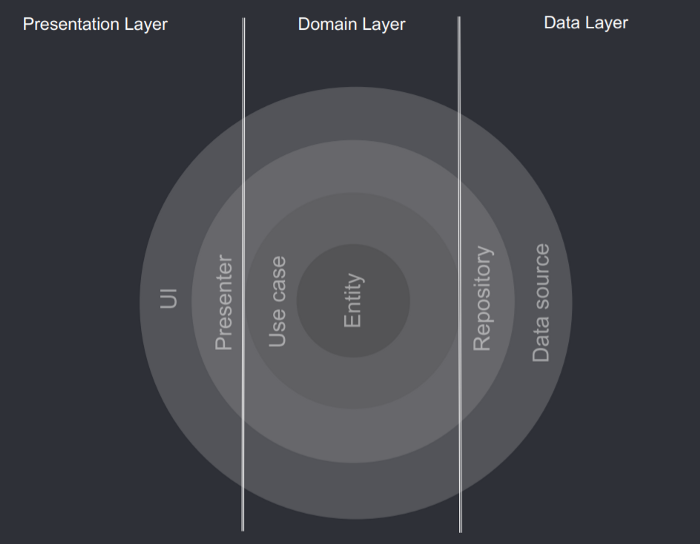

# Marvel Explorer

Marvel Explorer project shows modern Android development, following Android design and development
best practices. It's inspired by [NowInAndroid](https://github.com/android/nowinandroid) project
and [Guide to app architecture](https://developer.android.com/topic/architecture).

Application use data from [Marvel API] (https://developer.marvel.com/documentation/getting_started)

## _To Do improvements_

- Add [Paging library](https://developer.android.com/topic/libraries/architecture/paging/v3-overview) for view and local datasource, by the way remote datasource is a JSon mock not paginated 😟
- Add instrumented test on UI
- Put `com.lyh.marvelexplorer.feature.character.util` classes in a new module `feature-code-test`
- Create a custom Gradle Plugin for `java-library` module, and use it instead of `com.android.library` in modules don't have Android dependencies as `data-remote`, `data`, ...
- Create a custom Gradle Plugin for `compose` module
- Manage [large screen] (https://developer.android.com/guide/topics/large-screens/get-started-with-large-screens) 
- Use `SavedStateHandle` for passing parameters to screen whe [bug] (https://github.com/InsertKoinIO/koin/issues/1350) fixed 
- MinSDK set 24 instead of 21 because of this bug : [issue 171666278] (https://issuetracker.google.com/issues/171666278) & [issue 195786468] (https://issuetracker.google.com/issues/195786468). Investigate how to workaround this.
- implements retry when network request failed
- improve UI in landscape mode
- Use Flow.combine to have a single state per screens

## Setup

in `local.properties` file (in root of project) add Marvel API public and private key : 
```
publicApiKey="xxxxxxxxxxxxxxxxxxxxxxxxxxxxxxx"
privateApiKey="xxxxxxxxxxxxxxxxxxxxxxxxxxxxxxx"
```

To get an API Key, please register to [Marvel Developer portal] (https://developer.marvel.com/account), and follow `Get a key`

## Architecture

Application uses:

- **Clean Architecture** for separate business logic **[domain]**, services (storage, API,
  ...) **[data]** and **[presentation]** layers



- **MVVM** (Model-View-ViewModel) design pattern for presentation layer

Clean Archi and MVVM help:

- to avoid or reduce dependencies between layers (separation of concerns)
- to test easily
- to have uniform way to develop
- ...

Clean Architecture stack uses Flow to stream data, from data layer to presentation layer.

UI use Jetpack Compose.

## Modularization

- app **[clean-archi/presentation]**: Single-Activity and Application classes
    - feature-character: feature showing character data, using MVVM pattern
    - feature-core: common classes and resources (styles, strings, drawable) for feature modules
- build-logic : for gradle plugins, to share common configuration
- data **[clean-archi/data]**: repositories
    - data-local: to store and access data locally
    - data-remote: for API calls
- domain **[clean-archi/domain]**: for business logic, use-case

## Tests

- data: unit tests on repository and helper
    - data-local : Instrumented tests for use in-memory Room database
    - data-remote: unit tests on helper
- domain: unit tests on use-case
- app
    - feature-character : unit tests on view-model

## Build system

- Project uses Gradle build system with Kotlin DSL (kts).
- Catalog (with versions) of libraries and plugins is in `gradle/libs.versions.toml` see
  this [article](https://proandroiddev.com/gradle-version-catalogs-for-an-awesome-dependency-management-f2ba700ff894)
- Common gradle configuration is shared in custom gradle plugins in build-logic

## Libraries

List of libraries used in project:

- JetPack Navigation
- Coil to load image from URL
- Koin for dependency injection
- Kotlinx-serialization for Json de/serializer
- Material3 for UI components and styles
- OkHttp for HTTP calls
- Retrofit for API calls
- Room to persist local data in SQLite database
- Timber for logging
- For testing:
    - JUnit5 for unit tests
    - Mockk for mocking
    - Turbine for Flow test